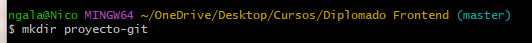
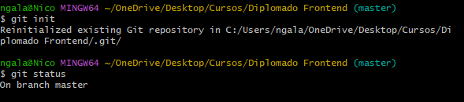
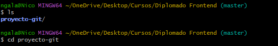
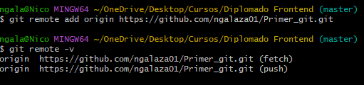
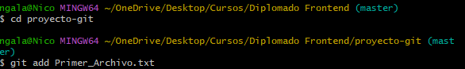
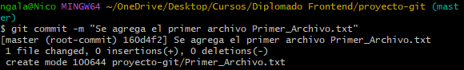
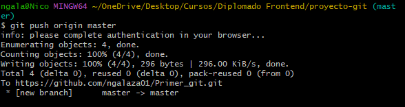
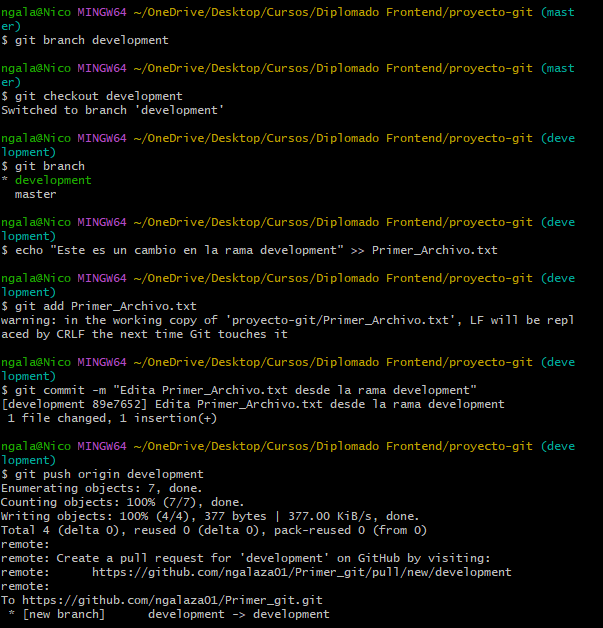
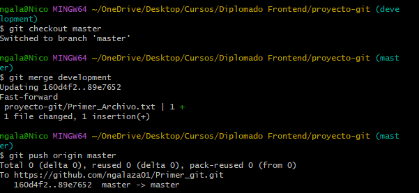

# Laboratorio de Git y GitHub

En este laboratorio se han realizado los siguientes pasos:

- Creación de un repositorio local.
- Inicialización y configuración de Git.
- Creación de un archivo `Primer_Archivo.txt`.
- Realización de commits y push a GitHub.
- Creación y cambio de ramas (`development`).
- Fusión (merge) de ramas a `master`.
- Uso de comandos básicos de Git para el control de versiones.

## Capturas de pantalla

A continuación se muestran algunas capturas que ilustran el proceso:

1) Se crea una carpeta con el nombre del repositorio `proyecto-git`

2) Se ingresa a la carpeta y se procede con la inicialización del repositorio

3) Se conecta el repositorio con GitHub

4) Se crea un archivo de texto, se genera un commit y se registran los cambios en GitHub

5) Se crea la rama `development` y se actualizan los cambios

6) Se realiza un merge entre la rama `master` y `development`, y se hace push para guardar los cambios en GitHub

